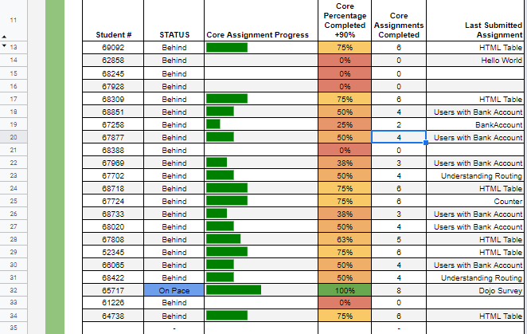
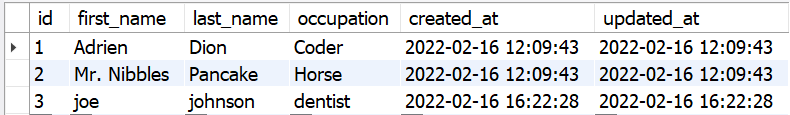
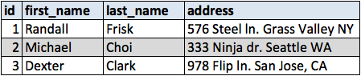
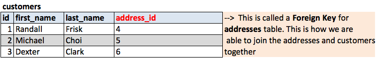
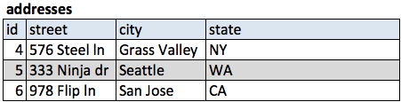
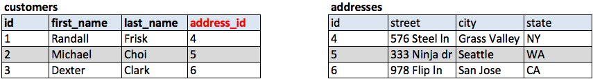
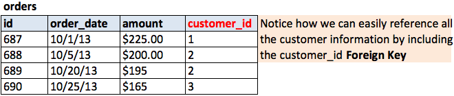
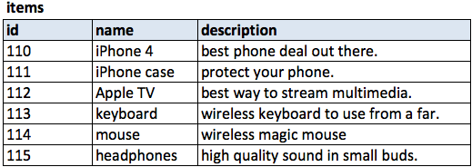

<!-- .slide:data-background="#000000" -->
---
# ERD Lesson
---
## overview
--

--

## What is a database?
<!-- .slide:data-background="#000000" -->

--
<!-- .slide:data-background="#000000" -->

--
## Why not just use a spreadsheet?
--
## Why MySQL and database design?
<!-- .slide:data-background="#000000" -->

--
Databases allow us to persist our data.
--
### databases also allow us to:
- create, save and manipulate data:
  - access, manage and update
--

### Goals
- minimize repetition
- minimize data queries

--

## Why ERD first?
- 'Entity Relationship Diagram' <!-- .element: class="fragment" -->
- visual plans  <!-- .element: class="fragment" -->
- map of the structure of data storage  <!-- .element: class="fragment" -->
- define relationships  <!-- .element: class="fragment" -->

 <!-- .element: class="fragment" -->
--

>Learning the design of the database first will help us visualize what our relational databases look like, which makes it much easier to choose the actual SQL syntax.

--

---
## database design
--

### principles of database design:

- reduce data repetition <!-- .element: class="fragment" -->  
- one table for each real world object*  <!-- .element: class="fragment" -->
- one column for each of the object's attributes  <!-- .element: class="fragment" -->
- decide the relationships between the objects/tables  <!-- .element: class="fragment" -->

--

---
<!-- .slide:data-background="#000000" -->
# Database Relations

---
## one to one
--
## one to one
 <!-- .element: class="fragment" -->
 <!-- .element: class="fragment" -->
 <!-- .element: class="fragment" -->
--
YAGNI

---
## one to many
--
## one to many
- most common
 <!-- .element: class="fragment" -->
 <!-- .element: class="fragment" -->

---
## many to many
--
## many to many
 <!-- .element: class="fragment" -->
 <!-- .element: class="fragment" -->
 <!-- .element: class="fragment" -->
--
- create a connector table(aka join table)  <!-- .element: class="fragment" -->
- can be confusing, talk out the relationship out loud
---
## normalization
-- 
### What is normalization?
-- 
>Database normalization is simply a convention for splitting large tables of data into smaller separate tables with the primary goal being to not repeat data.
--
<!-- .slide:data-transition="convex-in concave out" -->
# **It is possible to take normalization to an extreme.**
--
## The three forms:
--
### First Form
- one column, one value  <!-- .element: class="fragment" -->

  <!-- .element: class="fragment" -->
--
### Second Form

- each column should have a unique value  <!-- .element: class="fragment" -->
  - except for keys  <!-- .element: class="fragment" -->
  - This form can be taken too far!!!!  <!-- .element: class="fragment" -->
--

### Third Form
- no column should depend on another  <!-- .element: class="fragment" -->
  - except for keys  <!-- .element: class="fragment" -->
  - This form can be taken too far!!!!  <!-- .element: class="fragment" -->
---
## conventions
--
## conventions
1. table names are plural and lower case (i.e. users, sites, clients)
2. use `id` as the primary key
3. name foreign keys with singular table name(i.e. user_id, site_id, client_id)
4. use `created_at` and `updated_at` on EVERY table you create.

---
## data types
--
# `VARCHAR`
- up to 255 characters.
- will store variable number of characters
--
# `CHAR`
- up to 255 characters.
- will store all space reserved
--
# `INT`
- up to 4,294,967,295
- signed or unsigned
--
# `BIGINT`
- up to 18,446,744,073,709,551,615
- signed or unsigned
--
# `TINYINT`
- up to 255
- signed or unsigned
--
# `FLOAT` 
- used for decimal numbers
- signed or unsigned
--
# `TEXT`
- stores text
- stores text that `VARCHAR()` is too small to handle
--
# `DATETIME`
- stores dates
- format `YYYY-MM-DD hh:mm:ss`
---
## simple blog
--

  <!-- .element: class="r-stretch" " -->
---
## likes
---
## yelp
---
## amazon
---
## belts
---
## [users practice](https://login.codingdojo.com/m/172/7217/54135)
--
# [DEMO](./files/users_practice/README.md)
---
## dojos and ninjas cores core
---
## books core
---
## friendships practice
---