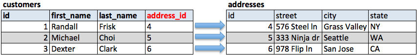
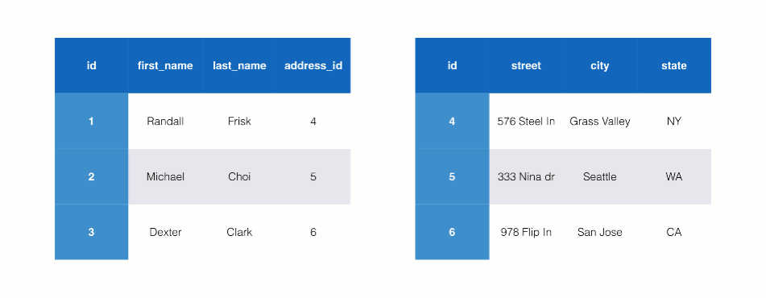
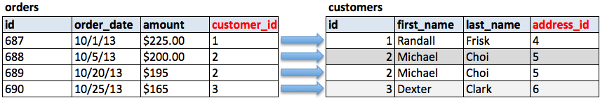
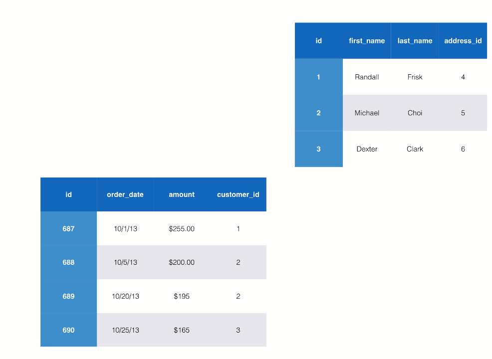
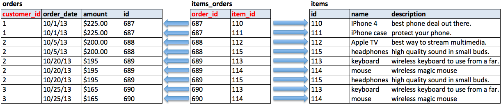
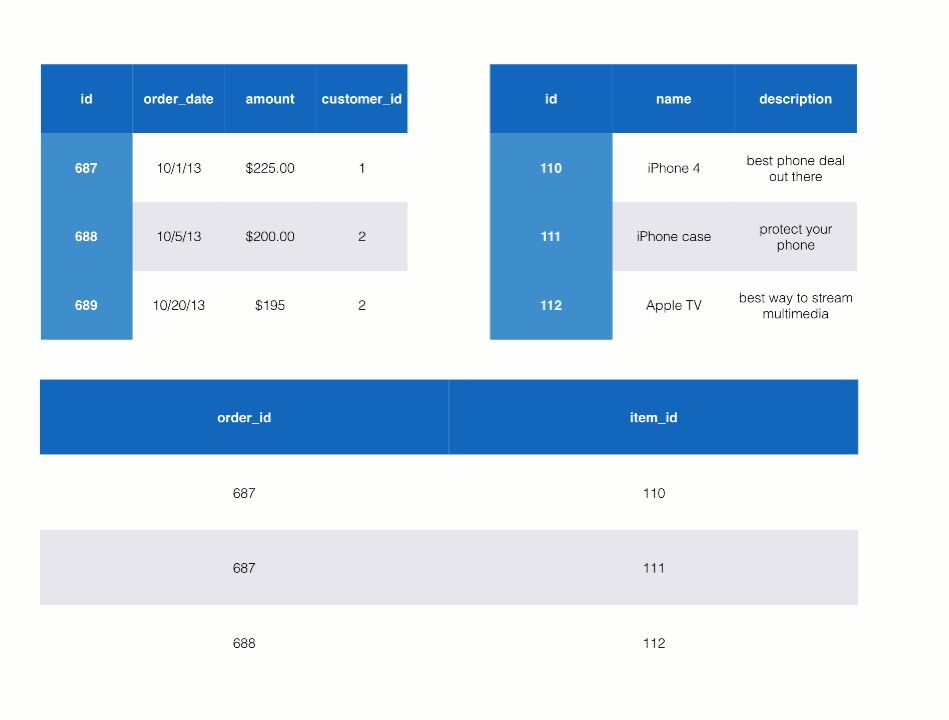

<!-- .slide:data-background="#000000" -->
---
# MySQL Queries
---
## SQL
--
### Intro to SQL
<!-- .slide:data-background="#999" -->
--
<!-- .slide:data-background="#999" -->
### Intro to SQL
- Structured Query Language <!-- .element: class="fragment" -->
- SQL statments aka queries can: <!-- .element: class="fragment" -->
  - SELECT <!-- .element: class="fragment" -->
  - INSERT <!-- .element: class="fragment" -->
  - UPDATE <!-- .element: class="fragment" -->
  - DELETE <!-- .element: class="fragment" -->
--
### Database and SQL
 


---
## Connecting to MySQL
--
- **MySQL server** is a database server listening on `localhost`
- we also have a web server listening on `localhost`
- They are listening on different ports
--
---
## Import
--
## Import

### two ways<!-- .element: class="fragment" -->

- copy and paste a sql file <!-- .element: class="fragment" -->
- forward engineer an ERD diagram <!-- .element: class="fragment" -->

---
## `SELECT`
--

--
<!-- .slide:data-background="#001100" -->
```sql
SELECT * FROM table_names; 
```
- select everything from table_names <!-- .element: class="fragment" -->
--
<!-- .slide:data-background="#000600" -->
```sql
SELECT column_name FROM table_names; 
```
- select column_name from table_names <!-- .element: class="fragment" -->
--
<!-- .slide:data-background="#000600" -->
```sql
SELECT column_name1, column_name2 FROM table_names; 
```
- select column_name1 and column_name2 from table_names <!-- .element: class="fragment" -->
--
### `SELECT` with Conditionals
--
<!-- .slide:data-background="#000600" -->

```sql
SELECT column_name1 
FROM table_names 
WHERE id = 2;
```

- select the record from column_name1 from table_names with an id of 2 <!-- .element: class="fragment" -->
--


---
## `INSERT`
--
<!-- .slide:data-background="#000600" -->

```sql
INSERT INTO table_name (column_name1, column_name2) 
VALUES('column1_value', 'column2_value');
```

---
## `UPDATE`
--
<!-- .slide:data-background="#000600" -->

```sql
UPDATE table_name 
SET column_name1 = 'some_value', column_name2='another_value' 
WHERE condition(s)
```
--
>IMPORTANT: if WHERE condition is not added to the UPDATE statement, the changes will be applied to every record in the table.
---
## `DELETE`
--
<!-- .slide:data-background="#000600" -->

```sql
DELETE FROM table_name (column_name1, column_name2) 
VALUES('column1_value', 'column2_value');
```
---
## Functions
---
## Joins
--
>We JOIN two tables on the ids (i.e. the primary key and the foreign key) that match each other. This means that we can't JOIN tables together that don't have a relationship with each other (e.g. One to One, One to Many, Many to Many).
--
### one to one

```sql
SELECT * FROM customers 
JOIN addresses ON addresses.id = customers.address_id;
```  
<!-- .element: class="fragment" -->
  <!-- .element: class="fragment" -->
  <!-- .element: class="fragment" -->

--
### one to many
```sql
SELECT * FROM orders 
JOIN customers ON customers.id = orders.customer_id;
```  
<!-- .element: class="fragment" -->
  <!-- .element: class="fragment" -->
--
  <!-- .element: class="r-fit" -->
--

### many to many
```sql
SELECT * FROM orders 
JOIN items_orders ON orders.id = items_orders.order_id 
JOIN items ON items.id = items_orders.item_id;
```  
<!-- .element: class="fragment" -->
  <!-- .element: class="fragment" -->
--
  <!-- .element: class="r-fit" -->
--


---
## Left Joins
---
## Export
---
## Forward Engineer
---
## MySQL Workbench Setup (Practice)
---
## Users (Practice)
---
## Dojo and Ninjas (Core)
---
## Friendships (Practice)
---
## MySQL Countries (Core)


---

---
## data types
--

--

---
## simple blog
---
## likes
---
## yelp
---
